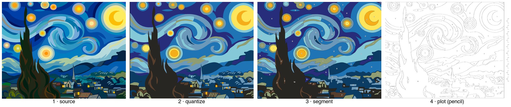
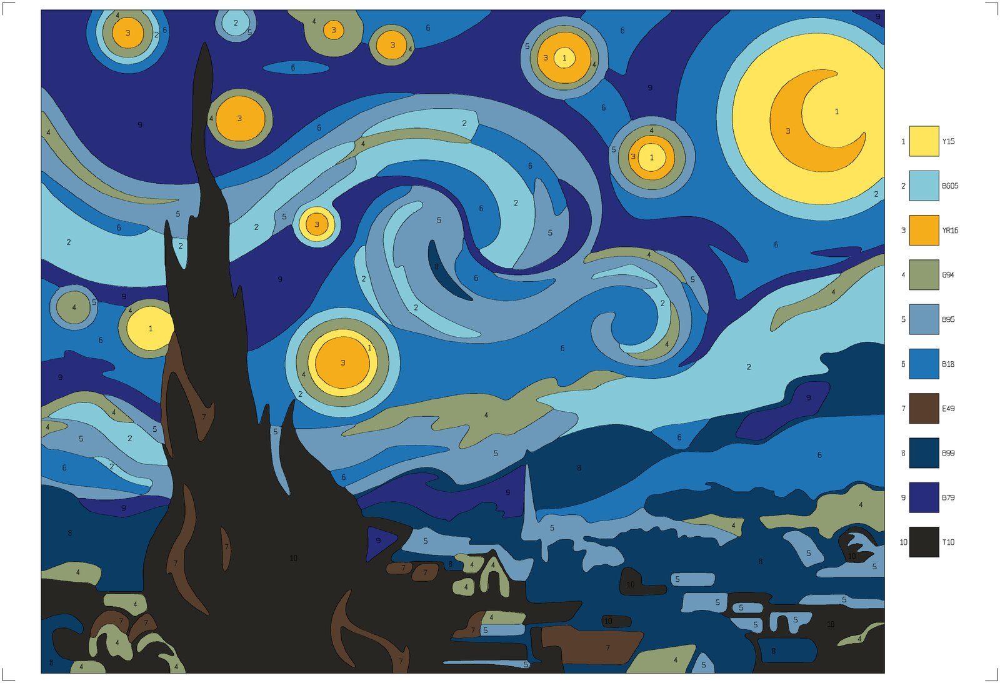
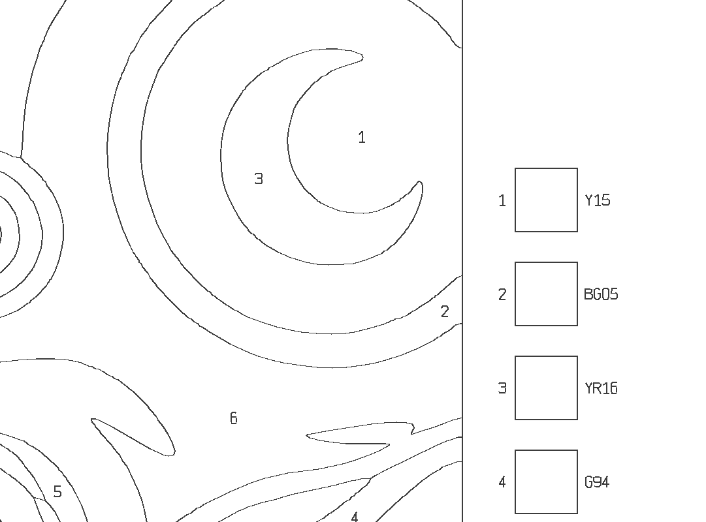

# plot-by-numbers

Turn any picture into a **paint-by-numbers template drawn by a pen plotter**, matched to
the markers or paints you actually own.



You give it an image (SVG or raster) and a palette from a real product line (Copic,
Stylefile, Talens Ecoline, …). It produces:

- an **HPGL file** that draws every region outline, a number in each region, and a legend
  with **one pen in one pass** (a pencil works well, because you colour over it afterwards),
- a **colour proof** showing how the finished painting will look,
- a **colour reference sheet** and a plot report with stroke length and estimated plot time.

The numbers also give the **painting order**: 1 is the lightest colour and the highest number
is the darkest. Paint light to dark and leave paper white blank. Markers then can't bleed
dark into light.

| Colour proof | Plotted lines, 1:1 detail |
|---|---|
|  |  |

The example is Van Gogh's *The Starry Night*: 135 regions, 10 Copic Sketch markers, A3
landscape on a Roland DXY-1200, about 4 minutes of plotting.

## What's inside

| | |
|---|---|
| `pbn/` | The pipeline (Python, numpy/scipy/Pillow): prepare → quantize → segment → vectorize → layout → hpgl, plus `pick`, `calib`, `send` and `swatch` tools |
| `palettes/` | Colour inventories of real products as JSON: **Copic Sketch** (350), **Stylefile Marker** (124), **Talens Ecoline** (59), **Artecho Acrylic** (48). `view.html` is a browser viewer for them |
| `examples/starry-night/` | Two complete projects: a stylised vector tracing and the raw museum photo |

Highlights:

- **Palette picking from what you own.** Weighted k-medoids in CIELAB chooses the *k*
  inventory colours that best cover the picture. You can force colours to stay in, for
  example the yellow of the moon.
- **Regions you can actually paint.** Regions under a minimum area merge into their
  neighbours, and you can set a maximum number of regions. Boundaries are smoothed, and
  shared borders are drawn once.
- **Numbers that fit.** Each number goes at the point of the region farthest from its
  border. Regions too small for the number are listed so you can write those in by hand.
- **Plotter-agnostic HPGL/1.** It uses a minimal command set (`IN SP VS PU PD`) and its own
  single-stroke font, so the plotter's character set isn't needed. Path order is
  nearest-neighbour, the output is checked against the drawable area, and scale and offset
  can be calibrated.
- **Serial sender for old plotters without handshake lines.** It sends blocks of at most
  256 bytes and synchronises with an `OS;` query after each block.

## Install

Requires Python ≥ 3.11 and, for SVG sources, [ImageMagick](https://imagemagick.org) 7 (`magick`).

```bash
python3 -m venv .venv && source .venv/bin/activate
pip install -r requirements.txt
```

`pyserial` is only needed for `send`.

## Quick start: the example

```bash
python -m pbn run examples/starry-night/starry-night.toml
```

The results are written to `examples/starry-night/out/`. Run it with
`starry-night-photo.toml` instead to start from the photo of the painting.

## Make your own

**1. Create a project.** Put your image somewhere, for example `projects/harbour/source.jpg`,
and add `projects/harbour/harbour.toml` next to it:

```toml
source = "source.jpg"
palette = "palette.json"     # created in step 3
```

All other settings have defaults (see [Configuration](#configuration)). Paths are relative
to the TOML file.

**2. Prepare the source** (render or resize it to the working size):

```bash
python -m pbn run projects/harbour/harbour.toml prepare
```

**3. Pick colours** from an inventory. This example chooses 10 Copic markers and keeps Y15:

```bash
python -m pbn pick projects/harbour/harbour.toml palettes/copic-sketch.json 10 --fixed Y15
```

The result is written to the project's `palette` file. You can also write that file by
hand: it's a JSON list of inventory entries, in any order.

**4. Run the rest and review:**

```bash
python -m pbn run projects/harbour/harbour.toml --from quantize
```

| Check | File in `out/` | If it's wrong |
|---|---|---|
| Colours | `quantized_compare.png` | Swap colours in the palette file, or use `pick` with other `--fixed` codes |
| Regions | `regions.png` | Change `[segment]`: `min_area_mm2` (larger = fewer, bigger regions), `max_regions`, `smooth_mm` |
| Sheet | `preview.png` (1:1 at 8 px/mm), `preview_color.png` | Change `[layout]` |

After a change, rerun from the step it affects, for example `--from segment`.

**5. Calibrate the plotter once** (see [Plotter setup](#plotter-setup)), then plot:

```bash
python -m pbn send projects/harbour/out/harbour.hpgl /dev/cu.usbserial-1130
```

Then colour the sheet light to dark, following `color-reference.png`.

## Commands

```text
python -m pbn run    PROJECT.toml [STEP ...] [--from STEP]   pipeline, default: all steps
python -m pbn pick   PROJECT.toml INVENTORY.json K [--fixed CODES] [-o OUT.json]
python -m pbn calib  PROJECT.toml                            out/calib-test.hpgl
python -m pbn send   FILE.hpgl PORT [--baud 9600]
python -m pbn swatch INVENTORY.json [-o OUT.pdf] [--bw]      A4 swatch card
python -m pbn png    PALETTE.json [-o OUT.png]               palette as PNG strip (1 px per colour)
```

| Step | Does | Writes to `out/` |
|---|---|---|
| `prepare` | Renders an SVG without antialiasing, or resizes a raster image. `crop_scan` straightens a photographed canvas and removes its border | `source.png` |
| `quantize` | Maps each pixel to the nearest palette colour in Lab, then removes noise (majority filter + opening) | `labels.png`, `palette.json`, `quantized_compare.png` |
| `segment` | Connected components, smallest-first merging, boundary smoothing | `regions.npz`, `regions.png` |
| `vectorize` | Traces shared boundaries once, smooths them (Douglas–Peucker + Chaikin), places numbers | `vectors.json`, `regions.svg` |
| `layout` | Sheet layout in mm with picture, legend, frame and corner marks | `layout.json`, `preview.svg/.png`, `preview_color.png`, `color-reference.png/.pdf` |
| `hpgl` | Orders the paths, writes HPGL and checks it | `<name>.hpgl`, `report.md` |

## Configuration

The values below are the defaults, from [`pbn/config.py`](pbn/config.py). Unknown keys
are rejected, so typos don't go unnoticed.

```toml
source = "…"            # .svg or raster image (required)
palette = "…"           # selection JSON (required)
out = "out"
name = "<toml name>"    # name of the .hpgl file
aspect = 1.27           # optional: stretch to this width/height (e.g. the real canvas)
work_width = 2000       # processing width in px; the mm scale follows from the sheet
svg_density = 84        # optional: ImageMagick -density, default = just enough for work_width
crop_scan = false       # photo of a canvas on a light background: deskew + crop the border

[quantize]
chroma_weight = 1.4     # distance = dL² + w·(da² + db²)
dark_boost = 1.0        # e.g. 2.5 for dark photos: spreads near-black tones apart
dark_l = 35.0           # dark_boost works below this L*…
dark_span = 15.0        # …fading in over this range…
dark_c = 28.0           # …and only on near-neutral pixels (chroma < dark_c)
dark_only = []          # codes only allowed where L* < dark_l, e.g. ["BG78"]

[segment]
min_area_mm2 = 45.0
max_regions = 280
smooth_mm = 1.0         # 0 = off
max_area_mm2 = 2500.0   # big regions stop swallowing neighbours

[layout]
margin_mm = 4.0
legend_width_mm = 24.0
gap_mm = 6.0
digit_height_mm = 2.0   # smallest height your pen draws legibly
box_mm = 12.0           # legend swatches (shrink automatically for many colours)

[plotter]
width_mm = 403.95       # drawable area = hard-clip limits, origin bottom left
height_mm = 276.0       # (default: Roland DXY-1200, A3 landscape)
pu_per_mm = 40.0        # plotter units per mm (HP/Roland: 1 PU = 0.025 mm)
scale_x = 1.0           # calibration: measured length of the 100 mm line / 100
scale_y = 1.0
offset_x_mm = 0.0       # shifts the whole plot
offset_y_mm = 0.0
speed_cm_s = 15         # VS; slower is kinder to pencils
pd_chunk = 32           # points per PD command (small buffers on old plotters)
```

## Plotter setup

1. **Drawable area.** Load your paper and send `OH;` (output hard-clip limits). The plotter
   replies `x1,y1,x2,y2` in plotter units. Set `width_mm = x2 / pu_per_mm` and
   `height_mm = y2 / pu_per_mm`.
2. **Calibration sheet.** Run `python -m pbn calib PROJECT.toml` and plot
   `out/calib-test.hpgl`. Measure the 100 mm square and ruler and set `scale_x`/`scale_y`.
   Then pick the smallest digit row (1.0 / 1.2 / 1.5 / 2.0 mm) that is legible with your pen
   and set it as `digit_height_mm`.
3. **Sending.** `send` talks 8N1 at 9600 baud and needs no CTS/DSR lines. It prints the
   plotter's `OI` identification first and the `OE` error code at the end. Any other way of
   getting HPGL to the plotter works too.

The HPGL is plain HPGL/1 and should run on most HP-compatible pen plotters. It was tested on
a Roland DXY-1200.

## Palettes

An inventory is a JSON list:

```json
[{ "code": "B18", "name": "Lapis Lazuli", "hex": "#1f74b6", "rgb": [31, 116, 182] }]
```

A selection (a project's `palette`) has the same format and lists only the colours used.

- **Browse:** run `python3 -m http.server` and open
  `http://localhost:8000/palettes/view.html?src=copic-sketch.json`, or open the file and use
  the file picker.
- **Check against reality:** `python -m pbn swatch palettes/copic-sketch.json` prints an A4
  card with the digital colour next to an empty field. Paint a real stroke into each field.
  The hex values are taken from manufacturer charts and are only approximations of the
  real ink.
- **Export as PNG:** `python -m pbn png palettes/copic-sketch.json` writes a one-pixel-high
  strip, one pixel per colour, for tools that take a palette as an image. Up to 256 colours
  it is an indexed PNG whose colour table is the palette; more colours fall back to RGB.
- **Add your own:** any product line works. Codes can use digits and the letters
  `B C E F G N R T V W Y`. Add glyphs to [`pbn/font.py`](pbn/font.py) if you need more.

## The example: *The Starry Night*

`examples/starry-night/` contains:

- `source/Van_Gogh_-_Starry_Night_-_Google_Art_Project.jpg`: the museum photo
  (Google Art Project via Wikimedia Commons, public domain)
- `source/starry-night-vectorized.svg`: a stylised vector tracing made in
  Affinity Designer, with flat colour areas that give clean regions
- `starry-night.toml`: the vector tracing, using
  `palettes/copic-affinity.json` (picked with `--fixed Y15,YR16,E49` so the moon, star cores
  and cypress strokes survive). Result: 135 regions, one too small for a number (marked in
  `regions.svg`)
- `starry-night-photo.toml`: the photo, with `crop_scan`, `dark_boost = 2.5` and a palette
  that includes BG78/W9 for the dark cypress. Result: about 250 regions

## Ideas / not done yet

- Several pens, for example coloured outlines (the HPGL writer always uses `SP1`)
- HPGL/2 or G-code output for other plotters and pen-equipped CNC machines
- Merging regions by colour difference as well as by size
